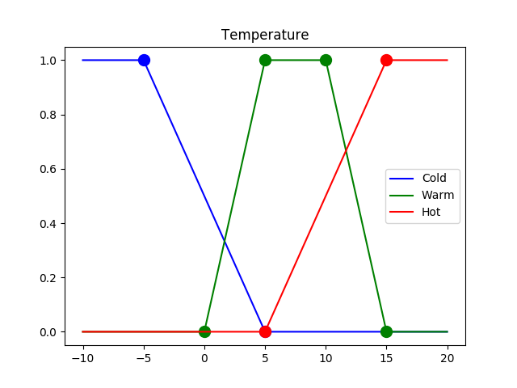
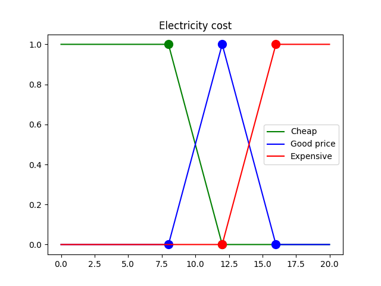

# Fuzzy system
Just a other python fuzzy rule-based system and reasoning package.
Based on the lecture's given by Ning Xiong at Märlardalens University.
Writen and implmented by @byteofsoren.


# Installation.
```
pip install fuzzy_system

```
# Basic usage
Assume that intended system for opening a valve dependent on price of electricity and the temperature in the environment.

Assume that the fuzzy set for the temperature and cost looks like this:


This is implemented like this in this module:
``` python
>>> import python_fuzzy_system as fuzzy

>>> cold = fuzzy.fuzzy_member_pointlist([[-5,1],[5,0]])
>>> warm = fuzzy.fuzzy_member_pointlist([[0,0],[5,1],[10,1],[15,0]])
>>> hot = fuzzy.fuzzy_member_pointlist([[5,0],[15,1]])

>>> cheap = fuzzy.fuzzy_member_pointlist([[8,1],[12,0]])
>>> good = fuzzy.fuzzy_member_pointlist([[8,0],[12,1],[16,0]])
>>> expensive = fuzzy.fuzzy_member_pointlist([[12,0],[16,1]])
```
Now fire each individual member can be done like:
``` python
>>> cold.fire(1.5)
0.35
```

# Creating rules for the system
Lets define a set of rules called Rn.
|Rule| Condition | Do |
|---|---|---|
| R1 | If Cheap AND Cold | Then Open |
| R2 | If Hot AND (Cheep OR good) | Then HalfOpen |
| R3 | If Expensive AND Hot | Then Closed


``` Python
r1 = cheep*cold
r2 = hot*(cheep + good)
r3 = expensive*hot
```


